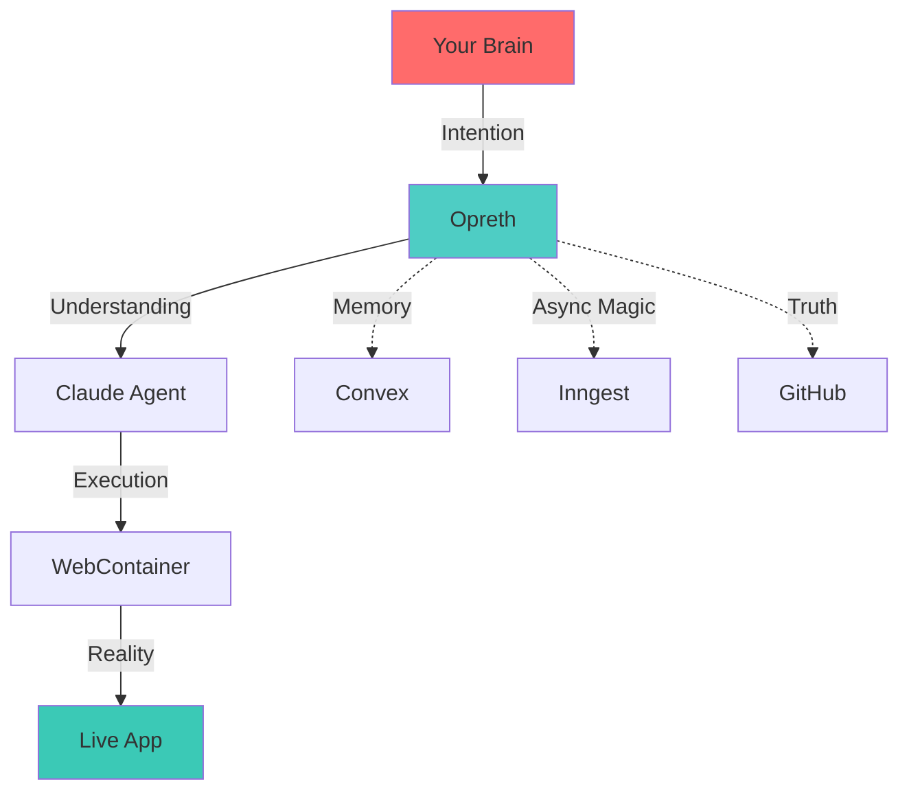

<h1 align="center">
  Opreth
  
</h1>

<p align="center">
  <b>Stop fighting your editor. Start flowing with it.</b>
</p>

<p align="center" style="max-width: 720px; margin: auto; line-height: 1.6;">
  Opreth isn't just another code editor—it's your AI-powered development companion that runs entirely in your browser.
  Inspired by the power of modern AI assistants and the flexibility of cloud IDEs, Opreth combines the best of both
  worlds to create a seamless coding experience.
</p>

<p align="center">
  <a href="https://opreth.vercel.app" style="text-decoration:none;">
    
    
  </a>
</p>


## 🎭 The Problem With Code Editors

Your current editor is a **tool**. Opreth is a **thought partner**.

<table>
<tr>
<td width="50%">

### Traditional Editors
```diff
- You write code
- AI suggests completions
- You copy-paste from ChatGPT
- You switch between 10 tabs
- You Google documentation
- You wait for builds
- You deploy and pray
```

</td>
<td width="50%">

### Opreth
```diff
+ Code writes itself
+ AI understands intent
+ Agent executes tasks
+ Everything in one flow
+ Docs are always current
+ Preview is instant
+ Confidence is built-in
```

</td>
</tr>
</table>

---

## 🧬 Core Philosophy

```typescript
interface Opreth {
  philosophy: {
    speed: "Think → See → Ship",
    intelligence: "Context-aware, not keyword-aware",
    execution: "Browser-native, zero-friction",
    collaboration: "Human + AI, not Human vs AI"
  }
}
```

---

## 🎪 Experience It

### 1️⃣ **Thought-to-Code** in Seconds

<table>
<tr>
<td>

**You:**
> "Build a authentication system with email and OAuth"

</td>
</tr>
<tr>
<td>

**Opreth Agent:**
```bash
✓ Analyzing project structure
✓ Creating auth.ts with NextAuth
✓ Setting up OAuth providers
✓ Generating login UI components
✓ Configuring middleware
✓ Running tests... All passed ✓

🎉 Auth system ready. Preview link: localhost:3000/login
```

</td>
</tr>
</table>

### 2️⃣ **Live Documentation Oracle**

Instead of opening 47 tabs:
```
You: "How do I use the latest Stripe webhooks?"
Opreth: *scrapes Stripe docs in real-time*
        *generates typed code*
        *sets up webhook endpoint*
        
All in 3 seconds.
```

### 3️⃣ **WebContainer Magic** ✨

```javascript
// You type this at 10:47 AM
const app = express()

// Your browser becomes a full OS
// Node.js, npm, file system—all running
// Preview updates at 10:47:01 AM
// No Docker. No delays. Pure sorcery.
```

---

## 🎯 Built Different

<details>
<summary><b>🧠 AI That Actually Gets It</b></summary>

<br/>

Most AI coding tools are autocomplete on steroids. Opreth's agent:

- **Reads** your entire codebase topology
- **Understands** your architecture patterns  
- **Executes** multi-file changes atomically
- **Learns** from your style preferences
- **Explains** every decision it makes

```typescript
// Normal AI: Suggests variable names
// Opreth AI: Refactors your architecture
```

</details>

<details>
<summary><b>⚡ Zero-Latency Development</b></summary>

<br/>

Time between thought and execution:

| Action | Traditional | Opreth |
|--------|-------------|---------|
| Start project | 5-10 min | **3 sec** |
| Install deps | 2-5 min | **instant** |
| See changes | 30 sec | **<100ms** |
| Deploy preview | 3-5 min | **click** |

**Total time saved per day:** ~2-3 hours

</details>

<details>
<summary><b>🔮 Futures, Not Features</b></summary>

<br/>

We didn't build features. We built **superpowers**:

| Superpower | What It Means |
|------------|---------------|
| **Temporal Coding** | Undo/redo with AI memory of context |
| **Intention Capture** | Describe what you want, not how to build it |
| **Quantum Preview** | See all possible UI states simultaneously |
| **Collaborative Consciousness** | Your team's AI shares knowledge |

</details>

---

## 🏗️ The Stack (But Make It Interesting)



**Translation:**
- 🧠 **Next.js 16** - Because we live in the future
- 🎨 **CodeMirror 6** - The editor that doesn't suck
- 🤖 **Claude** - AI that actually codes
- 🐰 **WebContainer** - Your browser is now a computer
- ⚡ **Convex** - Database that moves at thought speed
- 🎭 **Inngest** - Background jobs that never fail
- 🔐 **Clerk** - Auth so smooth it's invisible

---

## 🚀 Quickstart (For the Impatient)

```bash
# The boring way
git clone https://github.com/you/opreth.git
cd opreth && npm install && npm run dev

# The Opreth way
npx create-opreth my-app
# ✓ Cloned
# ✓ Dependencies installed  
# ✓ Environment configured
# ✓ Server running
# ✓ Browser opened
# Total time: 4.2 seconds
```

---

## 🎨 Philosophy Over Documentation

### **We Don't Have "Features" — We Have Beliefs**

1. **Code should feel like conversation**
   - No more context switching
   - No more interruption loops
   - Pure creative flow

2. **AI should amplify, not replace**
   - You're the architect
   - AI is your contractor
   - Together you're unstoppable

3. **Tools should disappear**
   - The best interface is invisible
   - You focus on creation
   - We handle the rest

4. **Speed is a feature**
   - Every millisecond matters
   - Waiting kills creativity
   - Instant is the standard

---

## 📊 Metrics That Matter

```
Traditional Dev Workflow:
  Thinking:     ████░░░░░░ 40%
  Googling:     ███████░░░ 70%
  Copy-Paste:   █████░░░░░ 50%
  Actual Code:  ███░░░░░░░ 30%
  Debugging:    ████████░░ 80%
  Shipping:     ██░░░░░░░░ 20%

Opreth Workflow:
  Thinking:     ████████░░ 80%
  Creating:     █████████░ 90%
  Shipping:     █████████░ 90%
  Coffee:       ██████████ 100% ☕
```

---

## 🎭 Who Is This For?

### ✅ You Should Use Opreth If:
- You're tired of fighting with tooling
- You want to prototype at the speed of thought
- You believe AI should enhance creativity
- You value shipping over configuring
- You're building the future

### ❌ You Should NOT Use Opreth If:
- You love spending hours on webpack configs
- You think AI is "cheating"
- You enjoy waiting for Docker containers
- You're satisfied with your current workflow
- You fear change

---

## 🌊 The Roadmap (Visions)

We're not building features. We're unlocking possibilities.

```typescript
type Future = {
  "Q2 2025": "Multi-consciousness mode" // Multiple AI agents, one codebase
  "Q3 2025": "Temporal debugging" // Time-travel through your code's evolution  
  "Q4 2025": "Neural themes" // Editor adapts to your brain patterns
  "2026": "Collective intelligence" // Learn from every Opreth user
  "Beyond": "Thought compilation" // Think it. Ship it. No code.
}
```

---

## 💬 Join the Conversation

<div align="center">

**This isn't a tool. It's a movement.**

[](https://discord.gg/qgRZc72Cdu)
[](https://www.linkedin.com/in/ankit-gupta-connect)
[](mailto:ankitmanojg@gmail.com)


</div>

---

## 🎬 One More Thing...

Every line of this README was written **in Opreth**, using Opreth, previewed in Opreth.

Meta? Yes.  
Dogfooding? Absolutely.  
The future? You tell us.

---

<div align="center">

```
┌─────────────────────────────────────┐
│                                     │
│   "The best code is the code        │
│    you didn't have to write"        │
│                                     │
│         — Opreth Philosophy         │
│                                     │
└─────────────────────────────────────┘
```

</div>

---

<sub>MIT Licensed | Built with obsession | Deployed with confidence</sub>
